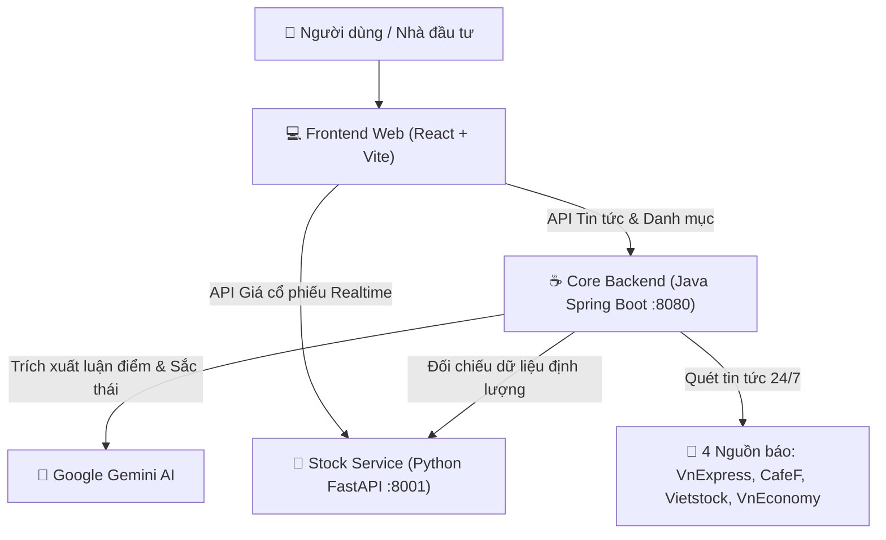

# FinAI - Trợ Lý Phân Tích Tin Tức & Thị Trường Chứng Khoán AI

<p align="center">
  
  
  
  
  
  
  
</p>

**FinAI** là nền tảng web thông minh tích hợp trí tuệ nhân tạo (AI) hỗ trợ nhà đầu tư cá nhân tự động tổng hợp tin tức tài chính đa nguồn, phân tích sắc thái cảm xúc thị trường (Sentiment Analysis), dịch thuật ngữ chuyên môn sang ngôn ngữ bình dân và tra cứu dữ liệu cổ phiếu thời gian thực.

---

## 🛠️ Công Nghệ Sử Dụng (Tech Stack)

| Phân tầng | Công nghệ / Framework | Vai trò trong hệ thống |
| :--- | :--- | :--- |
| **Frontend Web** | `React 19`, `TypeScript`, `Vite`, `Tailwind CSS`, `Framer Motion`, `Lucide Icons` | Giao diện tương tác mượt mà, biểu đồ tài chính, hiệu ứng chuyển động, thiết kế chuẩn Desktop & Mobile. |
| **Core Backend** | `Java 17`, `Spring Boot`, `Maven`, `Jsoup XML/RSS`, `Docker` | Điều phối dịch vụ, crawler quét và làm sạch dữ liệu từ 4 đầu báo lớn, quản lý danh mục và bảo mật. |
| **Stock Service** | `Python 3.10+`, `FastAPI`, `Uvicorn`, `yfinance`, `Pandas` | Microservice chuyên trách bóc tách giá khớp lệnh, lịch sử nến, chỉ số P/E, P/B và vốn hóa realtime. |
| **AI Engine** | `Google Gemini 1.5 Flash`, `NewsInsightExtractor (Rule-based Fallback)` | Đọc hiểu văn bản, trích xuất 3 luận điểm cốt lõi trong 30 giây, đo lường sắc thái (0 - 100%) và dịch thuật ngữ F0. |
| **Browser Extension** | `Chrome Manifest V3`, `Cloudflare Workers` | Tiện ích bôi đen tra cứu trực tiếp trên các trang báo VnExpress, CafeF mà không cần rời màn hình. |
| **Cloud Hosting** | `Vercel (Edge CDN)`, `Render (Docker & Python)` | Hạ tầng đám mây phân tán, tải trang siêu tốc dưới 0.5s và tự động mở rộng quy mô. |

---

## 🏛️ Kiến Trúc Hệ Thống (Architecture)

Hệ thống bao gồm các microservices chạy độc lập và phối hợp chặt chẽ:



---

## 🌟 Tính Năng Nổi Bật

* **Tổng hợp tin tức đa nguồn (Multi-source Aggregator):** Thu thập và chuẩn hóa dữ liệu tin tức tự động từ *VnExpress, CafeF, Vietstock, VnEconomy* với cơ chế xử lý song song, loại bỏ tin rác và bài trùng lặp.
* **Bóc tách Insight & Sắc thái thị trường:** Tự động nhận diện mã cổ phiếu liên quan (Ticker Tagging), đo lường mức độ tác động **Sentiment Score (Tích cực - Trung lập - Tiêu cực)**.
* **Tóm tắt 30 giây & Từ điển F0:** Rút trích 3 luận điểm tài chính quan trọng nhất và giải thích các chỉ số phức tạp (*P/E, EBITDA, NIM, Margin*) theo ngữ cảnh thực tế của doanh nghiệp.
* **Dữ liệu cổ phiếu Realtime:** Cập nhật biến động giá, chỉ số VN-Index, HNX-Index, biểu đồ kỹ thuật và định giá trực tiếp từ sàn chứng khoán.
* **Cá nhân hóa theo Danh mục (Personalized Advice):** Đối chiếu tin tức với danh mục tài sản thực tế của người dùng để đưa ra gợi ý hành động cụ thể (*Nắm giữ / Chốt lời / Hạ tỷ trọng / Canh điểm mua*).

---

## 📂 Cấu Trúc Dự Án (Project Structure)

```text
FinAI/
├── financial-ai-web/              # Giao diện người dùng Web App (React + Vite)
│   ├── src/
│   │   ├── assets/                # Hình ảnh, SVG minh họa & Logo
│   │   ├── components/            # UI Components (HeroSection, Features, StockSearch...)
│   │   ├── layouts/               # Dashboard Layout & Main Layout
│   │   ├── pages/                 # LandingPage, Overview, Portfolio, Dictionary...
│   │   ├── services/              # API Client kết nối Backend & Python Service
│   │   └── types/                 # TypeScript interfaces & Data Models
│   ├── vercel.json                # Cấu hình điều hướng Single Page Application trên Vercel
│   └── package.json
│
├── financial-ai-backend/          # Dịch vụ điều phối trung tâm (Spring Boot - Port 8080)
│   ├── Dockerfile                 # Multi-stage Dockerfile triển khai trên Render
│   ├── pom.xml                    # Maven dependencies
│   └── src/main/java/com/finai/
│       ├── controller/            # REST API Endpoints (News, Stocks, Glossary, Alerts)
│       ├── dto/                   # Data Transfer Objects
│       └── service/               # NewsService, GeminiService, StockService...
│
├── stock-service/                 # Dịch vụ dữ liệu chứng khoán thời gian thực (Port 8001)
│   ├── requirements.txt           # Thư viện: fastapi, uvicorn, yfinance, pandas
│   └── main.py                    # API tra cứu giá & thông tin doanh nghiệp
│
└── Extension/                     # Tiện ích mở rộng Chrome Extension (Manifest V3)
```

---

## 🚀 Hướng Dẫn Khởi Chạy Cục Bộ (Local Development)

### 1. Khởi chạy Frontend (`financial-ai-web`)
```bash
cd financial-ai-web
npm install
npm run dev
```
👉 Ứng dụng chạy tại: `http://localhost:5173`

---

### 2. Khởi chạy Core Backend (`financial-ai-backend`)
1. Cấu hình khóa Gemini API (tùy chọn) trong file `src/main/resources/application.properties` hoặc biến môi trường:
```properties
gemini.api.key=YOUR_GEMINI_API_KEY
```
2. Build và khởi chạy:
```bash
cd financial-ai-backend
mvn clean spring-boot:run
```
👉 Backend chạy tại: `http://localhost:8080`

---

### 3. Khởi chạy Stock Service (`stock-service`)
```bash
cd stock-service
pip install -r requirements.txt
uvicorn main:app --host 0.0.0.0 --port 8001 --reload
```
👉 Stock API chạy tại: `http://localhost:8001`
